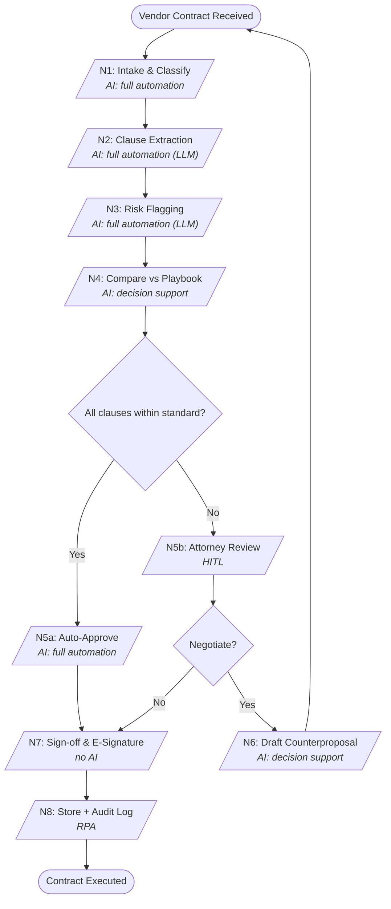

<!-- fde:sample_source=legal -->
# Vendor Contract Review

An AI-assisted workflow that reviews inbound vendor contracts: classify the contract,
extract and flag clauses, compare against the company playbook, then route to either
auto-approval or attorney review. Drop this file into the FDE Agent demo to have the
agent diagnose its pre-deployment risk.

> This file describes the workflow *structure only* (what each step does and how much
> AI is involved). It contains no risk labels or answers — the diagnosis (which nodes
> are RED, the mitigations) is produced by the agent's ontology + incident retrieval,
> not read from this file.

## Workflow Diagram

## Node Inventory
| Node | Function | AI Mode | Handles |
| N1 Intake & Classify | Classify incoming contract type (NDA / MSA / SOW) | Full automation (LLM classifier) | inbound contract -> type label |
| N2 Clause Extraction | Extract payment / IP / liability / termination clauses | Full automation (LLM) | contract text -> structured clauses |
| N3 Risk Flagging | Flag unusual liability caps, auto-renewal, indemnity | Full automation (LLM) | extracted clauses -> flagged items |
| N4 Compare vs Playbook | Measure deviation from the company standard playbook | Decision support | clauses -> deviation score |
| N5a Auto-Approve | Auto-approve and route to signatory when deviation is low | Full automation | deviation score -> approval routing |
| N5b Attorney Review | Lawyer reviews the LLM output against the source contract | HITL | flagged contract -> attorney decision |
| N6 Counterproposal | Draft a counter-proposal for negotiation | Decision support | terms -> counter draft |
| N7 Sign-off & E-Signature | DocuSign / Adobe Sign | No AI | approved contract -> signature |
| N8 Store + Audit Log | DMS + compliance archive | RPA | executed contract -> archive |
