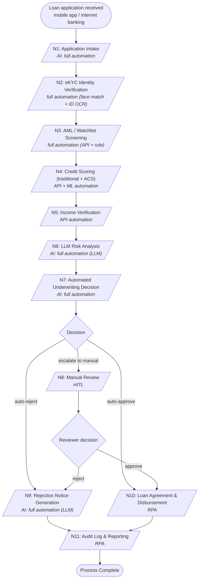

<!-- fde:sample_source=korean_loan -->
# Korean Personal Loan Underwriting

An automated consumer-loan underwriting workflow (South Korea): intake, eKYC, sanctions
screening, credit scoring (traditional + alternative), LLM risk analysis, an automated
decision engine, manual-review HITL, and disbursement. Drop this file into the FDE
Agent demo to have the agent diagnose its pre-deployment risk.

> Structure only — no risk labels or answers. Which nodes are RED and why is produced
> by the agent (ontology + incident retrieval), not read from this file.

## Workflow Diagram

## Node Inventory
| Node | Function | AI Mode | Handles |
| N1 Applicant Data Intake | Channel routing + identity-verification redirect | Full automation | application -> channel + identity redirect |
| N2 eKYC Identity Verification | Identity verification (face match + ID-card OCR) | Full automation (LLM-augmented OCR) | ID image + selfie -> verified identity |
| N3 AML / Watchlist Screening | OFAC / UN / KoFIU sanctions list + sanctioned-nationality filtering | Full automation (rule + API) | applicant -> sanctions match result |
| N4 Credit Scoring (Traditional + ACS) | KCB/NICE bureau + telco / e-commerce / mobile alternative credit scoring | API + ML automation | applicant data -> credit score |
| N5 Income Verification | Hometax / national-insurance cross-check | API automation | consent -> verified income |
| N6 LLM Risk Analysis | LLM analysis of anomalous transactions, fraud signals, social risk | Full automation (LLM) | applicant profile -> risk signals |
| N7 Automated Underwriting Decision | Decision engine: approve / reject / escalate to manual | Full automation | scores + signals -> decision |
| N8 Manual Review | Underwriter review + additional-document request | HITL | escalated case -> reviewer decision |
| N9 Rejection Notice Generation | Generate the Korean-language rejection notice | Full automation (LLM) | decision -> rejection notice |
| N10 Loan Agreement & Disbursement | E-contract + open-banking transfer | RPA | approval -> contract + transfer |
| N11 Audit Log & Reporting | Regulator (FSS) reporting + internal audit | RPA | outcome -> audit trail |
